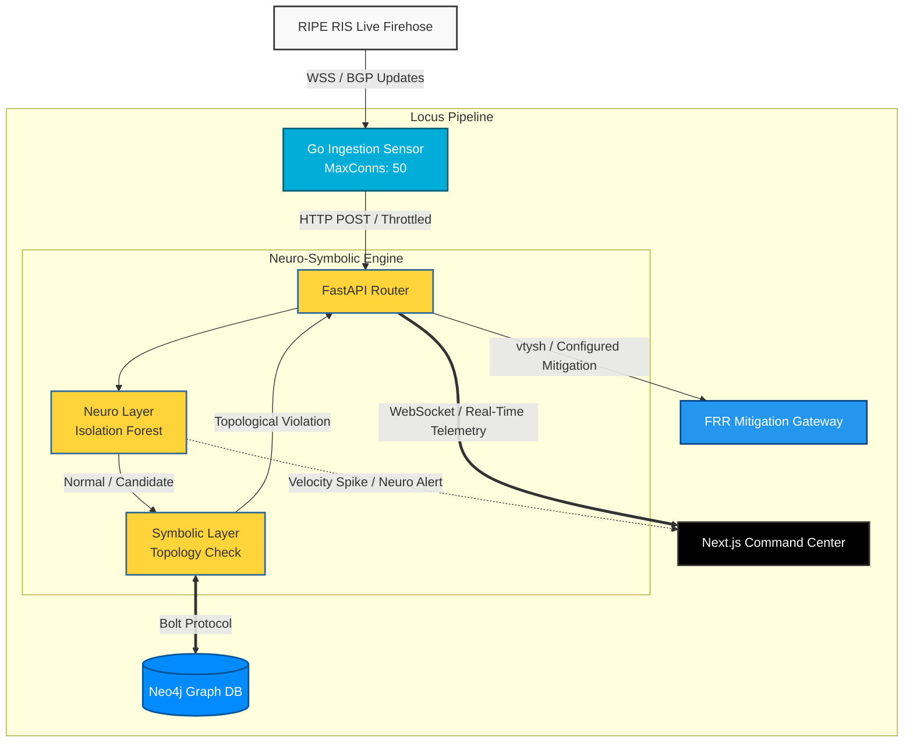

# LOCUS: Neuro-Symbolic BGP Telemetry & Automated Defense

LOCUS is a closed-loop cybersecurity platform designed to monitor global Internet routing activity, detect infrastructure-level threats such as **BGP hijacks** and **route leaks**, verify suspicious events using both machine learning and deterministic network-topology reasoning, and optionally apply automated mitigation.

The core idea is simple:

> **Collect → Detect → Verify → Defend → Visualize**

LOCUS combines an **Unsupervised Machine Learning layer (Neuro)** with a **Graph Database verification layer (Symbolic)**. This two-stage approach helps distinguish unusual routing behavior from events that are inconsistent with the expected network topology.

---

## Table of Contents

- [1. Project Overview](#1-project-overview)
- [2. Problem Statement](#2-problem-statement)
- [3. What is BGP?](#3-what-is-bgp)
- [4. What is a BGP Hijack?](#4-what-is-a-bgp-hijack)
- [5. LOCUS Solution](#5-locus-solution)
- [6. System Architecture](#6-system-architecture)
- [7. End-to-End Data Flow](#7-end-to-end-data-flow)
- [8. Core Microservices](#8-core-microservices)
- [9. Neuro-Symbolic Detection](#9-neuro-symbolic-detection)
- [10. Automated Mitigation](#10-automated-mitigation)
- [11. Command Center Dashboard](#11-command-center-dashboard)
- [12. Docker Compose Orchestration](#12-docker-compose-orchestration)
- [13. Technology Stack](#13-technology-stack)
- [14. Threat Detection Examples](#14-threat-detection-examples)
- [15. Threat Simulation](#15-threat-simulation)
- [16. Quick Start](#16-quick-start)
- [17. Project Structure](#17-project-structure)
- [18. Configuration](#18-configuration)
- [19. API Overview](#19-api-overview)
- [20. Operational Modes](#20-operational-modes)
- [21. Why Neuro-Symbolic?](#21-why-neuro-symbolic)
- [22. Why LOCUS is a Closed-Loop System](#22-why-locus-is-a-closed-loop-system)
- [23. Security and Safety Notes](#23-security-and-safety-notes)
- [24. Future Improvements](#24-future-improvements)
- [25. Limitations](#25-limitations)
- [26. License](#26-license)

---

# 1. Project Overview

**LOCUS** stands for:

**Neuro-Symbolic BGP Telemetry & Automated Defense**

It is a modular cybersecurity platform that observes BGP routing telemetry, identifies suspicious routing behavior, verifies potentially malicious routes against a network topology graph, and can send mitigation commands to a virtualized FRRouting (FRR) gateway.

At a high level:

```text
                BGP / INTERNET TELEMETRY
                         |
                         v
                +------------------+
                |   Go Sensor      |
                |   RIPE RIS       |
                +--------+---------+
                         |
                         | HTTP
                         v
                +------------------+
                | FastAPI Backend  |
                +--------+---------+
                         |
                         v
                +------------------+
                | Neuro Layer      |
                | Isolation Forest |
                +--------+---------+
                         |
                         v
                +------------------+
                | Symbolic Layer   |
                | Neo4j Topology   |
                +--------+---------+
                         |
                    Threat?
                    /      \
                  No        Yes
                  |          |
                  |          v
                  |    +-----------+
                  |    |    FRR    |
                  |    | Mitigation|
                  |    +-----+-----+
                  |          |
                  +----+-----+
                       |
                       v
                +------------------+
                | Next.js Dashboard|
                +------------------+
```

---

# 2. Problem Statement

The Internet depends heavily on BGP to exchange routing information between autonomous systems.

However, BGP was designed around trust between network operators. Incorrect or malicious route announcements can cause:

- Traffic to be redirected through an unintended network.
- Prefixes to be announced by an unauthorized origin.
- Routing instability.
- Route leaks.
- Traffic interception opportunities.
- Service disruption.
- Incorrect routing paths.

A traditional monitoring system may simply detect an anomaly and send an alert to an administrator.

LOCUS aims to go further:

```text
Monitor
   ↓
Detect
   ↓
Verify
   ↓
Respond
   ↓
Monitor again
```

This creates an automated closed-loop defense architecture.

---

# 3. What is BGP?

**BGP (Border Gateway Protocol)** is the routing protocol used to exchange reachability information between autonomous systems on the Internet.

An **Autonomous System (AS)** is a network or collection of networks managed by one organization under a common routing policy.

For example, a route may look conceptually like:

```text
Prefix:
8.8.8.0/24

AS Path:
AS64500 → AS64501 → AS15169
```

The AS path represents the autonomous systems through which traffic can be routed to reach the advertised prefix.

LOCUS observes changes in these routing announcements.

---

# 4. What is a BGP Hijack?

A BGP hijack occurs when an AS announces a prefix that it is not legitimately authorized to originate or transit.

For example, suppose:

```text
Legitimate route:

AS100 → AS200 → AS300
                  |
                  v
              10.20.30.0/24
```

An unexpected AS could announce the same prefix:

```text
AS999 → 10.20.30.0/24
```

Other networks may temporarily accept the announcement depending on routing policies and propagation.

LOCUS attempts to identify such suspicious changes by examining both:

1. **Statistical behavior**
2. **Network topology relationships**

---

# 5. LOCUS Solution

LOCUS uses five major stages:

### 1. Collect

The Go sensor receives live BGP updates from the RIPE RIS Live feed.

### 2. Detect

The Python/FastAPI engine uses an Isolation Forest and a sliding telemetry window to identify unusual behavior.

### 3. Verify

Suspicious routes are checked against a Neo4j graph representing network relationships and expected topology.

### 4. Defend

If a threat is verified and automatic mitigation is enabled, the engine communicates with FRRouting to apply the configured routing countermeasure.

### 5. Visualize

The Next.js dashboard receives live telemetry through WebSockets and displays threats, topology, incidents, and mitigation status.

---

# 6. System Architecture

LOCUS is implemented as a multi-container microservice architecture.



---

# 7. End-to-End Data Flow

The complete flow can be understood as follows:

```text
1. RIPE RIS
      |
      | Live BGP updates
      v
2. Go Sensor
      |
      | Parse prefix + AS path + metadata
      v
3. FastAPI
      |
      v
4. Isolation Forest
      |
      | Statistical anomaly?
      v
5. Neo4j
      |
      | Topology verification
      v
6. Decision Engine
      |
      +---- Normal --------------------+
      |                                 |
      +---- Suspicious -----------------+
      |                                 |
      +---- Confirmed Threat --> FRR ---+
                                      |
                                      v
7. WebSocket Telemetry
      |
      v
8. Next.js Dashboard
```

---

# 8. Core Microservices

## 8.1 Ingestion Sensor — Go

The Go application is responsible for collecting and preprocessing BGP telemetry.

### Responsibilities

- Maintain a persistent connection to RIPE RIS Live.
- Receive high-volume BGP updates.
- Parse routing information.
- Extract IP prefixes and AS paths.
- Use goroutines for concurrent processing.
- Use buffered channels to decouple receiving and processing.
- Forward normalized telemetry to the Python backend.
- Use a bounded HTTP connection pool.

### Why Go?

Go is well suited for this layer because it provides:

- Lightweight concurrency through goroutines.
- Channels for safe concurrent communication.
- Efficient network I/O.
- Low runtime overhead.
- Good performance for streaming workloads.

### Simplified architecture

```text
RIPE RIS
   |
   v
+----------------+
| BGP Reader     |
+-------+--------+
        |
        v
+----------------+
| Buffered       |
| Channel        |
+-------+--------+
        |
        +----> Worker 1
        |
        +----> Worker 2
        |
        +----> Worker 3
        |
        +----> Worker N
        |
        v
+----------------+
| HTTP Client    |
| Max Connections|
| = 50           |
+-------+--------+
        |
        v
     FastAPI
```

The bounded connection pool helps prevent excessive socket usage and operating-system file-descriptor exhaustion.

---

# 9. Neuro-Symbolic Detection

The main intelligence of LOCUS is divided into two complementary layers.

```text
              BGP EVENT
                  |
                  v
        +-------------------+
        | NEURO LAYER       |
        | Machine Learning  |
        +---------+---------+
                  |
                  v
        +-------------------+
        | SYMBOLIC LAYER    |
        | Graph Verification|
        +---------+---------+
                  |
                  v
             Final Decision
```

---

## 9.1 Neuro Layer — Isolation Forest

The Neuro layer uses:

```text
Scikit-Learn
IsolationForest
collections.deque
```

The system maintains a 60-second sliding window of recent routing observations.

### Example

Suppose a prefix normally generates:

```text
5 updates/minute
8 updates/minute
6 updates/minute
7 updates/minute
```

Then suddenly:

```text
150 updates/minute
```

The sudden change can be treated as a statistical anomaly.

The model can consider features such as:

- Update velocity.
- AS-path length.
- Other derived telemetry features implemented by the system.

### Important distinction

The ML layer identifies **anomalies**, not automatically proven attacks.

For example:

```text
ML:
"This behavior is unusual."
```

does not necessarily mean:

```text
"This is definitely an attack."
```

That is why LOCUS has a second verification layer.

---

## 9.2 Sliding Window

LOCUS uses a 60-second window to maintain recent routing behavior.

Conceptually:

```text
Current time
     |
     v
<------------------- 60 seconds ------------------->

Old events                         New events
  x   x   x   x   x   x   x   x   x   x   x   x
```

Older events leave the window as new events arrive.

This allows the system to calculate recent update velocity instead of relying only on historical averages.

---

# 10. Symbolic Layer — Neo4j

The Symbolic layer uses Neo4j to represent network relationships as a graph.

Instead of viewing the network only as rows and columns, it can be represented as:

```text
AS100 ----connected----> AS200
  |
  |
originates
  |
  v
10.20.30.0/24
```

A larger graph might look like:

```text
                 AS300
                /     \
               /       \
            AS200     AS400
              |
              |
            AS100
              |
              v
         IP Prefix
```

### What the symbolic layer checks

The graph can be queried to determine whether an observed AS path and prefix relationship is consistent with the topology represented by the system.

For example:

```text
Observed:

AS100 → AS200 → AS999

Graph knowledge:

AS100 → AS200 → AS300

Result:

Topology inconsistency
```

This provides deterministic evidence alongside the statistical ML signal.

---

# 11. Why use Neo4j?

Internet routing is naturally relationship-oriented.

There are relationships between:

- Autonomous systems.
- Prefixes.
- Origins.
- Transit networks.
- Neighbors.
- Observed paths.

Graph databases are therefore a natural representation for topology-related queries.

LOCUS communicates with Neo4j using the Bolt protocol.

---

# 12. Automated Mitigation

LOCUS can operate as an active defense platform.

The mitigation component uses **FRRouting (FRR)** inside a Docker container.

Conceptually:

```text
              Threat confirmed
                     |
                     v
              Python Engine
                     |
                     v
            Mitigation Decision
                     |
                     v
                vtysh / FRR
                     |
                     v
             Routing Response
```

The actual mitigation policy should be carefully controlled and tested in an isolated environment.

Potential configured responses include routing actions such as:

- Blackholing a destination.
- Injecting a configured route.
- Applying a configured sub-prefix override.

---

# 13. AUTO_MITIGATION Kill Switch

LOCUS provides an operational safety mechanism:

```text
AUTO_MITIGATION = OFF
```

means:

```text
Detect
  ↓
Verify
  ↓
Log
  ↓
Dashboard
```

No automatic routing modification is performed.

When:

```text
AUTO_MITIGATION = ON
```

the configured mitigation path becomes available after threat verification.

This allows the system to be operated in:

### Monitoring mode

```text
Detection + Verification + Logging
```

or:

### Active-defense mode

```text
Detection + Verification + Automated Mitigation
```

For development and demonstrations, monitoring mode is generally the safer default.

---

# 14. Command Center Dashboard

The frontend is built using:

- Next.js
- React
- WebSockets
- SVG-based topology visualization

The dashboard is designed as a real-time security command center.

### Main functions

#### Live telemetry

Displays:

- Threat counters.
- Detection events.
- Current status.
- Telemetry logs.

#### Topology visualization

Displays:

- AS nodes.
- Network relationships.
- Suspicious paths.
- Potential topology violations.

#### Incident management

Records:

- Prefix.
- Detection vector.
- AS path.
- Detection timestamp.
- Verification result.
- Mitigation status.

Example:

```text
+------------------------------------------------+
|              LOCUS COMMAND CENTER              |
+------------------------------------------------+
| Threats | Normal Routes | Mitigated            |
|    12   |     8492      |     7                |
+------------------------------------------------+
|                                                |
|              NETWORK TOPOLOGY                  |
|                                                |
|        AS100 -------- AS200                    |
|           \             |                      |
|            \            |                      |
|             ------ AS999 ⚠                    |
|                                                |
+------------------------------------------------+
| INCIDENT LOG                                   |
+------------------------------------------------+
| Velocity Spike       | Investigating           |
| Topology Violation   | Mitigated               |
| Route Change         | Normal                  |
+------------------------------------------------+
```

---

# 15. WebSocket Telemetry

The frontend maintains a WebSocket connection with FastAPI.

Instead of continuously refreshing the page, FastAPI can push events as they happen.

```text
FastAPI
   |
   | WebSocket
   v
Next.js
   |
   v
React State
   |
   v
Dashboard Update
```

This is useful for real-time cybersecurity monitoring.

The backend also handles disconnected clients so stale WebSocket connections do not remain indefinitely.

---

# 16. Docker Compose Orchestration

LOCUS consists of multiple technologies:

```text
Go
Python
Neo4j
FRRouting
Next.js
```

Docker Compose brings them together.

Conceptually:

```text
docker-compose.yml

+---------------------------+
| LOCUS Docker Environment  |
|                           |
|  +-------+    +--------+ |
|  | Go    | -> | FastAPI| |
|  +-------+    +---+----+ |
|                   |       |
|              +----+----+  |
|              | Neo4j   |  |
|              +---------+  |
|                   |       |
|              +----+----+  |
|              |   FRR   |  |
|              +---------+  |
|                           |
|              +---------+  |
|              | Next.js |  |
|              +---------+  |
+---------------------------+
```

A single command can build and launch the stack:

```bash
docker-compose up --build
```

---

# 17. Technology Stack

| Layer | Technology | Purpose |
|---|---|---|
| BGP Telemetry | RIPE RIS | Live routing data |
| Ingestion | Go | High-performance streaming |
| Concurrency | Goroutines + Channels | Parallel processing |
| API | Python + FastAPI | Backend and orchestration |
| ML | Scikit-Learn | Anomaly detection |
| ML Model | Isolation Forest | Unsupervised anomaly detection |
| Sliding Window | Python deque | Recent telemetry state |
| Graph DB | Neo4j | Network topology |
| Graph Protocol | Bolt | Neo4j communication |
| Routing | FRRouting | Virtual routing / mitigation |
| Containerization | Docker | Service isolation |
| Orchestration | Docker Compose | Multi-service deployment |
| Frontend | Next.js + React | Command center |
| Real-time | WebSocket | Live telemetry |
| Visualization | SVG / React | Network topology |

---

# 18. Threat Detection Examples

LOCUS can demonstrate several classes of suspicious behavior.

## 18.1 Velocity Spike

Normal:

```text
5–10 updates/minute
```

Sudden:

```text
150 updates/minute
```

Potential result:

```text
Neuro Layer
     ↓
Statistical Anomaly
```

---

## 18.2 AS-Path Anomaly

Normal:

```text
AS100 → AS200 → AS300
```

Observed:

```text
AS100 → AS200 → AS999 → AS888 → AS777 → AS300
```

The significant change in path characteristics can be investigated by the Neuro layer and then verified against the topology graph.

---

## 18.3 Topology Violation

Observed:

```text
AS999 → Prefix X
```

But the graph contains no valid relationship for:

```text
AS999 → Prefix X
```

Potential result:

```text
Symbolic Layer
       ↓
Topology Violation
```

---

## 18.4 Combined Detection

The strongest case occurs when both layers provide evidence:

```text
Isolation Forest
       ↓
Anomaly

      +

Neo4j
       ↓
Topology Violation

      ↓

High-confidence security event
```

---

# 19. Threat Simulation

The following examples are intended for a local development/demo environment where the LOCUS API is running on `localhost:8000`.

> **Safety note:** Keep FRR and any automated mitigation isolated from production routing infrastructure during testing. Synthetic API events should be used for demonstrations rather than injecting unauthorized routing changes into real networks.

---

## 19.1 Velocity Spike & Path Anomaly

This simulates a routing event with an unusually long AS path.

Fire it repeatedly in quick succession to exercise the sliding-window velocity detection.

### PowerShell

```powershell
Invoke-RestMethod `
  -Uri "http://127.0.0.1:8000/analyze" `
  -Method Post `
  -Body '{"prefixes":["10.200.1.0/24"], "as_path":[1299,174,3356,701,1239,6453,6762,12956,3257,2914,3320,5511,8928,9002]}' `
  -ContentType "application/json"
```

### curl

```bash
curl -X POST "http://127.0.0.1:8000/analyze" \
  -H "Content-Type: application/json" \
  -d '{"prefixes":["10.200.1.0/24"],"as_path":[1299,174,3356,701,1239,6453,6762,12956,3257,2914,3320,5511,8928,9002]}'
```

Expected conceptual flow:

```text
API
 ↓
Sliding Window
 ↓
Velocity / Path Features
 ↓
Isolation Forest
 ↓
Neuro Anomaly
```

---

## 19.2 Bogon / Reserved ASN Simulation

This example simulates a suspicious route containing reserved/private ASN values.

### PowerShell

```powershell
Invoke-RestMethod `
  -Uri "http://127.0.0.1:8000/analyze" `
  -Method Post `
  -Body '{"prefixes":["172.16.50.0/24"], "as_path":[3356,64512,65535]}' `
  -ContentType "application/json"
```

### curl

```bash
curl -X POST "http://127.0.0.1:8000/analyze" \
  -H "Content-Type: application/json" \
  -d '{"prefixes":["172.16.50.0/24"],"as_path":[3356,64512,65535]}'
```

Expected conceptual flow:

```text
API
 ↓
Symbolic Verification
 ↓
Topology / ASN validation
 ↓
Potential violation
```

---

## 19.3 Targeted Sub-Prefix Hijack Simulation

A targeted sub-prefix event can be represented using a more-specific prefix and an unexpected origin.

For example:

```json
{
  "prefixes": ["10.200.1.42/32"],
  "as_path": [3356, 64512]
}
```

### PowerShell

```powershell
Invoke-RestMethod `
  -Uri "http://127.0.0.1:8000/analyze" `
  -Method Post `
  -Body '{"prefixes":["10.200.1.42/32"], "as_path":[3356,64512]}' `
  -ContentType "application/json"
```

### curl

```bash
curl -X POST "http://127.0.0.1:8000/analyze" \
  -H "Content-Type: application/json" \
  -d '{"prefixes":["10.200.1.42/32"],"as_path":[3356,64512]}'
```

The expected application behavior depends on the topology data loaded into Neo4j and the detection rules implemented in the current version of LOCUS.

---

# 20. Quick Start

## Prerequisites

You only need:

- Docker
- Docker Compose
- Git

The stack is intended to provide its own Go, Python, Node.js, Neo4j, and FRR environments through containers.

---

## Step 1 — Clone the Repository

```bash
git clone <YOUR_REPOSITORY_URL>
cd <YOUR_REPOSITORY_DIRECTORY>
```

Replace the placeholders with the actual repository URL and directory.

---

## Step 2 — Build and Launch

```bash
docker-compose up --build
```

Or, on installations using the newer Docker Compose command:

```bash
docker compose up --build
```

---

## Step 3 — Access the Services

### Next.js Command Center

```text
http://localhost:3000
```

### FastAPI

```text
http://localhost:8000
```

### Neo4j Browser

```text
http://localhost:7474
```

The exact ports can be changed in `docker-compose.yml`.

---

## Step 4 — Stop the Stack

```bash
docker-compose down
```

To remove associated volumes when appropriate:

```bash
docker-compose down -v
```

> Be careful with `-v`, because it removes Docker volumes and can delete persisted database data.

---

# 21. Project Structure

A recommended repository structure is:

```text
LOCUS/
│
├── docker-compose.yml
├── README.md
├── .env.example
├── .gitignore
│
├── ingestion/
│   ├── Dockerfile
│   ├── go.mod
│   ├── go.sum
│   └── ...
│
├── backend/
│   ├── Dockerfile
│   ├── requirements.txt
│   ├── app/
│   │   ├── main.py
│   │   ├── routes/
│   │   ├── services/
│   │   ├── ml/
│   │   └── websocket/
│   └── ...
│
├── neo4j/
│   ├── init/
│   └── ...
│
├── frr/
│   ├── Dockerfile
│   ├── frr.conf
│   └── ...
│
└── frontend/
    ├── Dockerfile
    ├── package.json
    ├── next.config.*
    ├── app/
    ├── components/
    └── ...
```

The actual structure may differ depending on the implementation.

---

# 22. Configuration

Configuration should be kept outside source code where possible.

Example `.env`:

```env
AUTO_MITIGATION=false

API_HOST=0.0.0.0
API_PORT=8000

NEO4J_URI=bolt://neo4j:7687
NEO4J_USER=neo4j
NEO4J_PASSWORD=change_this_password

FRR_CONTAINER=loc-us-frr

FRONTEND_PORT=3000
```

Do not commit real credentials or production secrets to Git.

Use an `.env.example` file to document required variables.

---

# 23. API Overview

The central analysis endpoint is conceptually:

```text
POST /analyze
```

Example request:

```json
{
  "prefixes": [
    "10.200.1.0/24"
  ],
  "as_path": [
    3356,
    64512,
    65535
  ]
}
```

The endpoint can:

1. Receive the routing event.
2. Extract features.
3. Update the sliding window.
4. Run anomaly detection.
5. Perform graph verification where applicable.
6. Generate an incident/result.
7. Broadcast telemetry to connected dashboard clients.
8. Trigger the configured mitigation path when appropriate.

Additional endpoints depend on the implementation.

---

# 24. Operational Modes

LOCUS can conceptually operate in three modes.

## Mode 1 — Observe

```text
BGP
 ↓
Detect
 ↓
Log
```

No automatic mitigation.

---

## Mode 2 — Detect & Verify

```text
BGP
 ↓
ML
 ↓
Neo4j
 ↓
Verified Incident
```

Still no automatic routing change.

---

## Mode 3 — Active Defense

```text
BGP
 ↓
ML
 ↓
Neo4j
 ↓
Threat Confirmed
 ↓
FRR Mitigation
```

The active mode should only be used in an isolated and controlled test environment unless appropriate operational safeguards and authorization are in place.

---

# 25. Why Neuro-Symbolic?

A major design decision in LOCUS is combining two different reasoning approaches.

## Machine Learning

Machine learning is useful for detecting patterns that are difficult to encode manually.

Example:

```text
Update velocity suddenly changes
```

The model can identify this as unusual.

## Symbolic Reasoning

Graph-based rules are useful when a relationship must satisfy a known constraint.

Example:

```text
Does AS999 have a valid relationship
with Prefix X?
```

This is deterministic and explainable.

## Combined

```text
        Machine Learning
              |
              | "Unusual"
              v
       +--------------+
       | Investigation|
       +------+-------+
              |
              v
        Graph Reasoning
              |
              | "Topology violation"
              v
        Security Event
```

The architecture therefore combines:

```text
Statistical Detection
        +
Deterministic Verification
```

---

# 26. Why LOCUS is a Closed-Loop System

A normal monitoring solution might stop after detection:

```text
Detect
  ↓
Alert
```

LOCUS is designed as:

```text
Collect
  ↓
Detect
  ↓
Verify
  ↓
Mitigate
  ↓
Observe the result
  ↓
Continue monitoring
```

This creates a feedback loop.

```text
             +------------------+
             |                  |
             v                  |
         Monitor                |
             |                  |
             v                  |
          Detect                |
             |                  |
             v                  |
          Verify                |
             |                  |
             v                  |
         Mitigate --------------+
```

This is the central architectural concept of LOCUS.

---

# 27. Key Engineering Features

LOCUS demonstrates several software engineering concepts in one system.

### Distributed architecture

Multiple services communicate over network interfaces.

### Concurrent programming

Go goroutines and channels process high-volume telemetry.

### Streaming data processing

BGP updates arrive continuously instead of as a fixed dataset.

### Machine learning

Isolation Forest performs unsupervised anomaly detection.

### Graph databases

Neo4j models routing relationships.

### API development

FastAPI exposes backend functionality.

### Real-time communication

WebSockets stream events to the dashboard.

### Network engineering

FRRouting provides a virtual routing environment.

### Containerization

Docker isolates each service.

### Orchestration

Docker Compose launches and connects the complete stack.

### Visualization

Next.js/React provides real-time operational visibility.

---

# 28. Main Advantages of the Architecture

## Modular

Each service has a focused responsibility.

## Scalable

The ingestion layer can use concurrent workers and bounded connection pools.

## Real-time

Telemetry can flow from the BGP source to the dashboard continuously.

## Explainable

The graph layer provides deterministic topology evidence in addition to ML anomaly scores.

## Automated

The platform can optionally apply configured mitigation actions.

## Demonstrable

Synthetic API requests make it possible to demonstrate the detection pipeline without needing to create real-world BGP incidents.

---

# 29. Limitations

LOCUS is a research/engineering platform and should not be treated as a guarantee that every BGP incident will be detected or correctly classified.

Important limitations include:

- Statistical anomaly detection can produce false positives and false negatives.
- A topology database is only as useful as the data and relationships stored in it.
- BGP behavior can change for legitimate operational reasons.
- Global Internet routing is highly dynamic.
- Automatic mitigation can have unintended consequences if incorrectly configured.
- A local FRR container does not represent every condition of a real Internet routing environment.
- RIPE RIS provides observed routing data rather than an omniscient view of the entire Internet.

For these reasons, production deployment requires additional validation, authorization, safeguards, testing, and operational controls.

---

# 30. Security and Safety Notes

### Never test automated mitigation against networks you do not own or have explicit authorization to operate.

For demonstrations:

- Use synthetic `/analyze` events.
- Keep FRR inside an isolated Docker network.
- Keep `AUTO_MITIGATION=false` unless the complete test environment is controlled.
- Do not expose FRR management interfaces publicly.
- Do not commit passwords or API secrets.
- Validate all commands before executing them.
- Add authentication and authorization before exposing administrative endpoints.
- Add audit logging for mitigation actions.
- Add rate limiting to administrative APIs.
- Consider a manual approval mode for high-impact responses.

---

# 31. Future Improvements

Potential future development areas include:

### Better ML features

Add features such as:

- Prefix announcement frequency.
- Origin AS changes.
- AS-path edit distance.
- Withdrawal/announcement ratios.
- Historical route stability.
- Temporal features.

### Multiple ML models

Compare Isolation Forest with:

- One-Class SVM.
- Local Outlier Factor.
- Autoencoders.
- Other streaming anomaly-detection approaches.

### Improved topology reasoning

Add:

- Relationship types.
- Historical route snapshots.
- Prefix ownership information.
- Confidence levels.
- More detailed route-policy constraints.

### Explainable detection

Show why a route was flagged:

```text
Reason:
Velocity +280%
AS-path length +75%
Origin changed
Topology relationship missing
```

### Human approval workflow

Instead of immediate mitigation:

```text
Threat
 ↓
Verification
 ↓
Human approval
 ↓
Mitigation
```

### Production hardening

Add:

- Authentication.
- Role-based access control.
- TLS.
- Secret management.
- Persistent audit logs.
- Health checks.
- Metrics.
- Distributed tracing.
- Better service recovery.

---

# 32. Example Full Incident Lifecycle

A complete LOCUS incident can be represented as:

```text
                  BGP UPDATE
                       |
                       v
                +-------------+
                | Go Sensor   |
                +------+------+
                       |
                       v
                +-------------+
                |  FastAPI    |
                +------+------+
                       |
                       v
                +-------------+
                | Isolation   |
                | Forest      |
                +------+------+
                       |
                  Anomaly?
                  /      \
                No        Yes
                |          |
                |          v
                |    +-----------+
                |    |  Neo4j    |
                |    | Topology  |
                |    +-----+-----+
                |          |
                |     Violation?
                |       /     \
                |     No       Yes
                |     |         |
                +-----+         v
                      |    +-----------+
                      |    | Decision  |
                      |    +-----+-----+
                      |          |
                      |     Mitigation
                      |     enabled?
                      |       /   \
                      |     No     Yes
                      |     |       |
                      |     |       v
                      |     |     FRR
                      |     |       |
                      +-----+-------+
                            |
                            v
                    WebSocket Event
                            |
                            v
                    Next.js Dashboard
                            |
                            v
                     Incident Logged
```

---

# 33. One-Sentence Explanation

If someone asks:

> **"What is LOCUS?"**

Use:

> **LOCUS is a closed-loop BGP security platform that combines machine-learning anomaly detection with graph-based topology verification to detect suspicious routing events and, when safely configured, automatically apply mitigation through FRRouting while providing real-time visibility through a web dashboard.**

---

# 34. 30-Second Project Explanation

> **LOCUS monitors live BGP routing telemetry from RIPE RIS using a high-performance Go ingestion service. The data is sent to a FastAPI backend where an Isolation Forest identifies statistical anomalies such as unusual update velocity or path behavior. Suspicious events are then verified against a Neo4j graph representing network topology. If the event is confirmed and automated mitigation is enabled, the system can communicate with an FRRouting gateway to apply a configured countermeasure. At the same time, WebSockets send real-time telemetry to a Next.js dashboard, allowing administrators to visualize threats, topology, and mitigation status.**

---

# 35. The LOCUS Concept in Five Words

```text
COLLECT
   ↓
DETECT
   ↓
VERIFY
   ↓
DEFEND
   ↓
VISUALIZE
```

That is the complete idea behind LOCUS.

---

# License

Add the license selected by your project/team here.

Example:

```text
MIT License
```

Replace this section with the actual license and copyright information used by the project.
